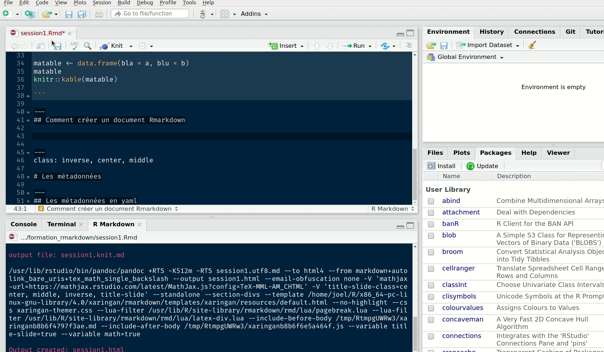

```{r setup, include=FALSE}
options(htmltools.dir.version = FALSE)
```

```{r xaringan-themer, include=FALSE, warning=FALSE}
library(xaringanthemer)
style_duo_accent(primary_color = "#1F4257", secondary_color = "#F97B64")
```

## Rmarkdown, c'est quoi ?

La rencontre entre **markdown** (une syntaxe très simple de mise en forme de texte) et **R**. Entre les deux, [pandoc](https://pandoc.org/), un outil libre permettant la conversion entre de très nombreux formats de documents. 

```{r exemple}

a <- 1
b <- 2 * a

matable <- data.frame(bla = a, blu = b)
matable
knitr::kable(matable)

```

---
## Comment créer un document Rmarkdown



---
class: inverse, center, middle

# Les métadonnées

---
## Les métadonnées en yaml

```{yaml}
---
title: "Rmarkdown, documentation et génération automatique de rapports"
subtitle: "Session 1 : les bases"  
author: "Joël Gombin"
date: 'Le 3 juin 2020'
output:
  xaringan::moon_reader:
    lib_dir: libs
    css: xaringan-themer.css
    nature:
      highlightStyle: github
      highlightLines: true
      countIncrementalSlides: false
---
```

La partie la plus importante est le champ `output` : il définit le (ou les) fonctions qui vont générer le fichier de sortie (ici la fonction `xaringan::moon_reader`), et ses arguments (dont on peut retrouver la documentation dans l'aide de la fonction en question).

---
## Les métadonnées en yaml

**Attention, l'indentation compte en YAML !**

On peut viser plusieurs formats de sortie :

```{yaml}
output:
  html_document:
    toc: true
  pdf_document:
    keep_tex: true
```

Les valeurs des arguments peuvent être des expressions en R, en utilisant `!expr` :

```{yaml}
output:
  html_document:
    fig_width: !expr 3 + 5
```

---
class: inverse, center, middle

# Le Markdown

---
## Une syntaxe minimaliste

En markdown on applique un style soit au niveau des blocs de texte :

```{md}
# Un titre de niveau un

## Un titre de niveau deux
```

soit au niveau d'un bout de texte (inline) : `**comme ça**` pour du **gras**, `_comme ça_` pour de l'_italique_. Les liens s'écrivent ainsi : `[le texte du lien](www.monlien.fr)`. Pour insérer une image la syntaxe est proche : ``. 


Pour écrire des équations, on peut inclure du LaTeX :

```{latex}

$$ E = MC^2$$
```

$$ E = MC^2$$

Enfin, si le format visé de sortie est du html, on peut inclure directement du html dans le texte. Si on vise du LaTeX, on peut inclure du LaTeX. Et ainsi de suite.

---
class: inverse, center, middle

# Les chunks R

---
## Insérer et exécuter du code R

Il suffit d'insérer dans son fichier markdown un _chunk_ :

````markdown
`r ''````{r}

3 + 4

```
````

```{r}
3 + 4
```

